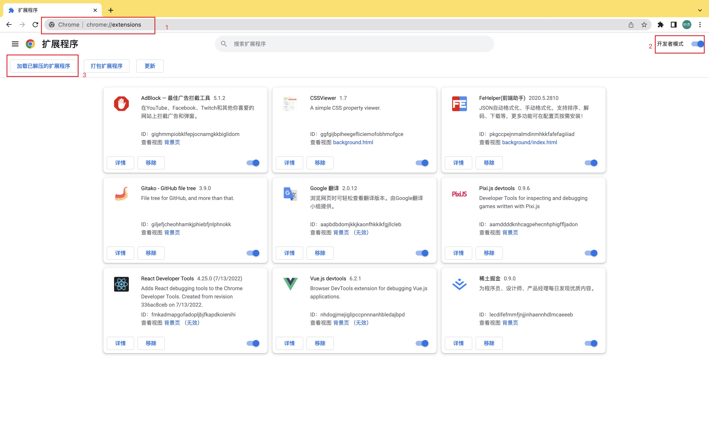
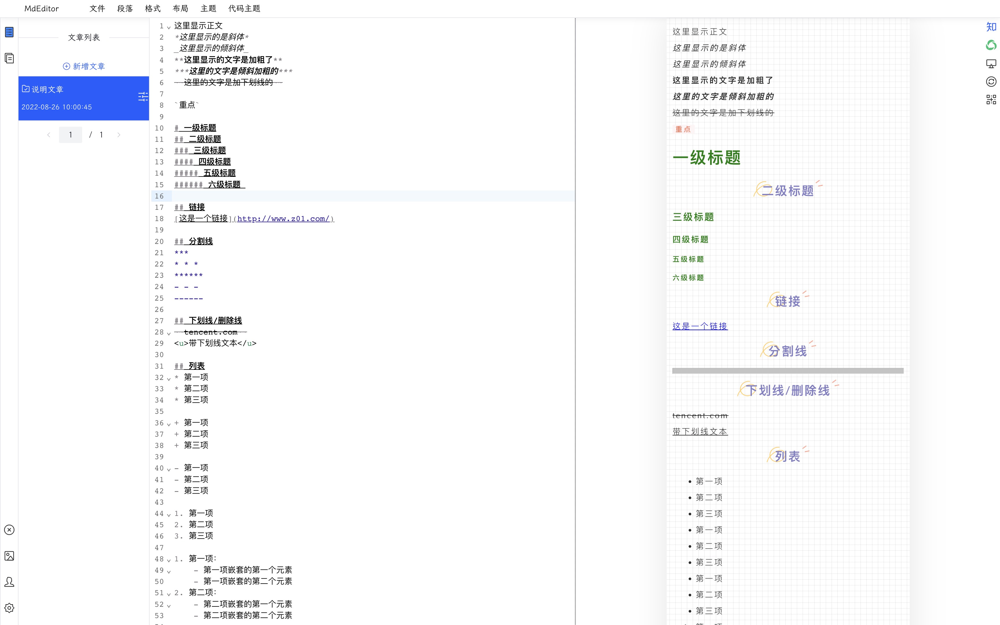
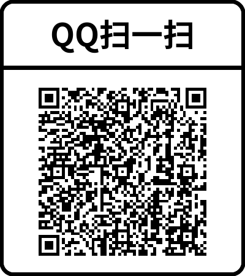

# MdEditor

## 简介

&#x3000; &#x3000;在线的 MarkDown 编辑器,为自媒体提供多平台发布器,同时具备多平台文章排版美化功能,让你的文章别具一格!

## 特性

- 在线 markdown 编辑器
- 多平台内容编辑器
- 多平台发布器
- 多平台内容美化器,优化排版!

## 多平台发布需要安装插件

[谷歌插件传送门](https://chrome.google.com/webstore/detail/%E5%BE%AE%E4%BF%A1%E5%85%AC%E4%BC%97%E5%8F%B7%E5%90%8C%E6%AD%A5%E5%8A%A9%E6%89%8B/hchobocdmclopcbnibdnoafilagadion)
> 没办法访问谷歌商店的

1. 下载下面压缩包并且解压
   [谷歌插件](https://github.com/UvDream/MdEditor/blob/master/docs/1.0.13_0.zip)
2. 打开谷歌浏览器,输入地址栏输入 `chrome://extensions/`
3. 打开开发者模式
4. 点击 `加载已解压的扩展程序`
5. 选择解压后的文件夹
6. 安装成功
7. 重启浏览器
   

# 教程

[halo同步教程](./docs/halo.md)

[微信公众号同步教程](./docs/weixin.md)

## 样式预览

### 主界面

### 多品台发布界面

## 客户端

[客户端下载链接](https://github.com/UvDream/MdEditor/releases)

## 计划表

- [ ] 黑白模式切换
- [ ] 更多的主题支持
- [ ] 更多的 markdown 语法支持
- [ ] 更多的组件支持
- [ ] 手机端支持
- [ ] 快捷键完善(目前只支持Mac快捷键,部分存在bug)

# 如有疑惑或者需求提出,请在 [issues](https://github.com/UvDream/MdEditor/issues) 中提出

# 联系我

| 微信                                                 | QQ                                  |
|----------------------------------------------------|-------------------------------------|
|  |  |

